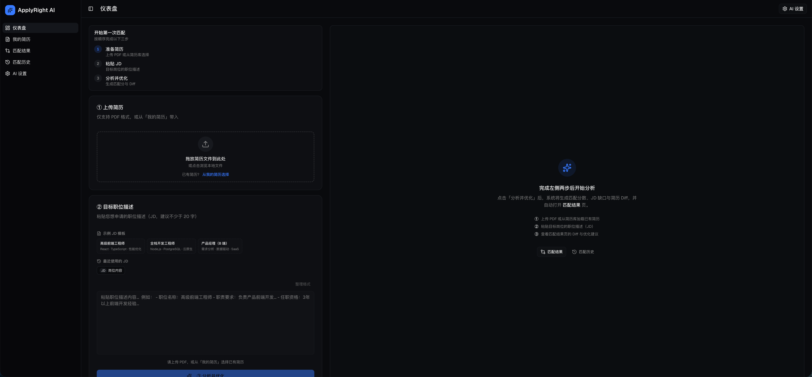
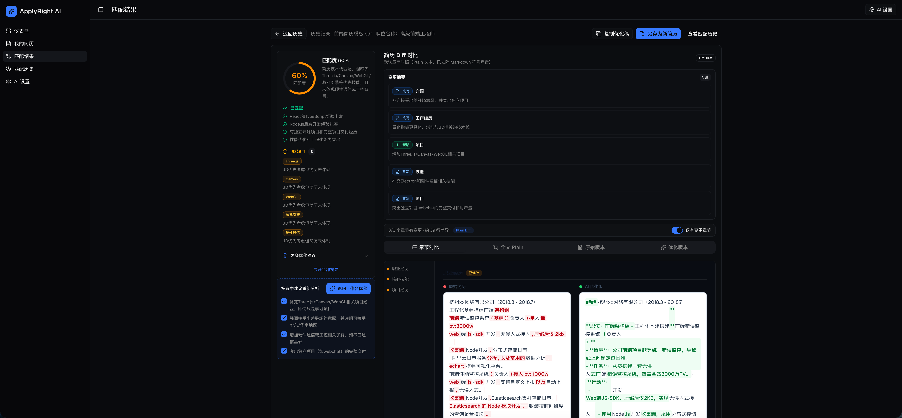
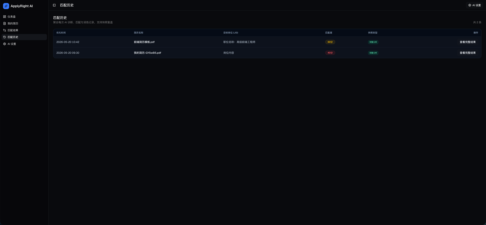
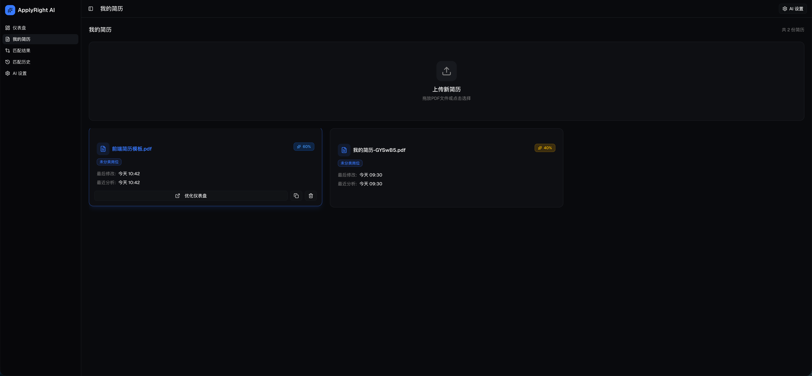
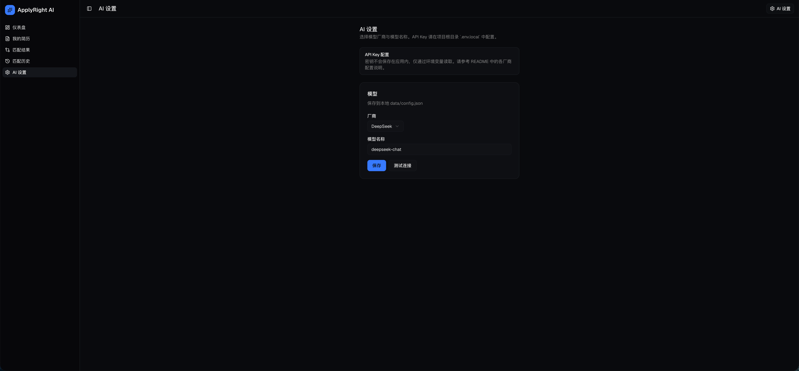

# ApplyRight AI

自托管的开源简历与岗位 JD 智能匹配工具。在本地运行 Next.js，使用你自己的 AI API Key；简历、匹配记录与配置保存在 `data/` 目录，无需登录、无需云端数据库。

## 界面预览

截图位于 [`docs/promotion/screenshots/`](docs/promotion/screenshots/)。

### 工作台

上传 PDF 简历、粘贴岗位 JD，一键分析匹配度、优劣势与优化建议。



### 章节 Diff

原文与 AI 润色版左右对照，按章节查看改写差异（Plain 文本，便于复制到简历）。



### 匹配历史

保存每次投递的对齐结果，可按记录回看分数与摘要。



### 我的简历

管理多份 PDF 简历，快速切换用于分析。



### AI 设置

在应用内切换 AI 厂商与模型；API Key 仅通过 `.env` 配置，不会写入 `data/config.json`。



## 功能

- 上传 PDF 简历并对照 JD 进行 AI 匹配分析
- 匹配度、缺口关键词、润色建议与章节级 Diff
- 匹配历史回放与多份简历管理
- 多 AI 厂商：**OpenAI**、**DeepSeek**、**Anthropic**、**Ollama**（BYOK）

## 要求

- Node.js 20+
- npm

## 快速开始

```bash
git clone https://github.com/Rowe83/ApplyRight-AI.git
cd ApplyRight-AI
cp .env.example .env.local
# 编辑 .env.local，填入所选厂商的 API Key
npm install
npm run dev
```

浏览器打开 [http://localhost:3000](http://localhost:3000)（无需登录）。

DeepSeek 示例：

```env
AI_PROVIDER=deepseek
AI_MODEL=deepseek-chat
DEEPSEEK_API_KEY=你的密钥
DEEPSEEK_BASE_URL=https://api.deepseek.com
```

## 环境变量

| 变量 | 说明 |
|------|------|
| `DATA_DIR` | 数据目录，默认 `./data` |
| `AI_PROVIDER` | `openai` \| `deepseek` \| `anthropic` \| `ollama` |
| `AI_MODEL` | 模型名称 |
| `OPENAI_API_KEY` | OpenAI（可选 `OPENAI_BASE_URL`） |
| `DEEPSEEK_API_KEY` / `DEEPSEEK_BASE_URL` | DeepSeek |
| `ANTHROPIC_API_KEY` | Anthropic |
| `OLLAMA_BASE_URL` | 本地 Ollama，默认 `http://127.0.0.1:11434` |

在应用内打开 [**AI 设置**](http://localhost:3000/dashboard/settings)（`/dashboard/settings`）可切换厂商与模型，配置写入 `data/config.json`。**API Key 仅通过 `.env` 配置，不会写入磁盘上的 config 文件。**

## 数据备份

| 内容 | 路径 |
|------|------|
| 简历 PDF 与元数据 | `data/resumes/{id}/` |
| 匹配历史 | `data/history/` |
| 应用配置 | `data/config.json` |

`data/` 已加入 `.gitignore`。备份时复制整个目录即可。

## 安全提示

本应用面向本机或可信内网自托管，**不包含登录与访问控制**。请勿在未加防护的情况下将实例暴露到公网。

## 开发

```bash
npm run lint
npm run build
npm start
```

## 版本与 License

- 发布说明：[v0.1.0](docs/releases/v0.1.0.md)
- License：MIT — 见 [LICENSE](LICENSE)
