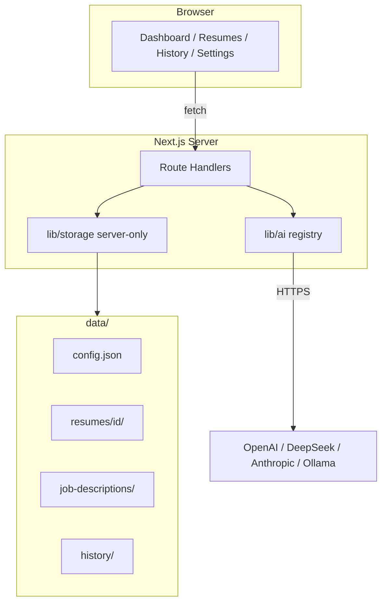

# Open-Source Self-Hosted Refactor

**Date:** 2026-05-19  
**Status:** Approved (design) — pending implementation  
**Replaces:** SaaS + Supabase + billing model

## Summary

Transform ApplyRight-AI from a paid, Supabase-backed resume-matching SaaS into a **GitHub open-source, single-user self-hosted** app. Users bring their own AI API keys via `.env`. All data lives on the local filesystem under `data/`. No login, no credits, no Stripe, no template library in v1.

## Decisions (locked)

| Topic | Choice |
|-------|--------|
| Deployment | Personal self-hosted (`pnpm dev` / `pnpm start`) |
| Backend | Remove Supabase entirely (no auth, no cloud DB) |
| Persistence | Pure filesystem under `data/` |
| AI | Multi-provider presets (`openai`, `deepseek`, `anthropic`, `ollama`) |
| Feature scope | Core workbench + match result + resumes + history; **no** template library |
| Delivery | README + `.env.example` + local dev; `data/` auto-created; Docker **not** required in v1 |
| Architecture | Server-side storage layer + Route Handlers (recommended approach 1) |
| License | MIT |

## Goals

1. Anyone can `git clone`, configure `.env`, run `pnpm dev`, and use resume–JD matching locally.
2. Data survives restarts via `data/` (user backs up by copying the folder).
3. Switching `AI_PROVIDER` (and model) works without code changes.
4. Repository has no runtime dependency on Supabase or Stripe.

## Non-goals (v1)

- Multi-user accounts or per-user API keys in DB
- Docker / Compose as required path (optional later)
- Resume template library and `clone-template`
- Billing, credits, Stripe, mock purchase
- Built-in HTTP auth (instance assumed local/trusted)
- i18n overhaul (UI may stay Chinese; README bilingual optional)

## Architecture



- **Client** never reads/writes `data/` directly.
- **API keys** only in process environment (`.env`), never in `data/config.json` or git.
- **PDFs** served via `/api/resumes/[id]/file`, not static `public/` mapping.

## Directory layout (`data/`)

```
data/
├── config.json
├── resumes/
│   └── {resumeId}/
│       ├── meta.json
│       └── source.pdf          # optional
├── job-descriptions/
│   └── {jdId}.json
└── history/
    └── {historyId}.json
```

`DATA_DIR` env optional (default `./data` relative to project root). Created on first server access if missing. Entire `data/` in `.gitignore`.

### `data/config.json` (non-secret)

```json
{
  "provider": "deepseek",
  "model": "deepseek-chat"
}
```

Priority: `config.json` → `.env` (`AI_PROVIDER`, `AI_MODEL`) → provider defaults.

### Resume `meta.json`

```json
{
  "id": "uuid",
  "original_filename": "resume.pdf",
  "raw_text": "plain text from PDF",
  "parsed_name": null,
  "target_job": null,
  "last_match_score": 78,
  "last_match_at": "2026-05-19T12:00:00.000Z",
  "created_at": "ISO8601",
  "updated_at": "ISO8601"
}
```

- No `user_id`, no `file_url` (PDF path implicit: same folder `source.pdf`).
- `last_match_*` updated on each successful optimize.

### Job description `{jdId}.json`

```json
{
  "id": "uuid",
  "job_title": "Senior Frontend Engineer",
  "full_text": "…",
  "created_at": "ISO8601"
}
```

### History `{historyId}.json`

Aligns with existing `MatchingHistoryRow` minus `user_id`; embeds JD for replay:

```json
{
  "id": "uuid",
  "resume_id": "uuid",
  "resume_title": "resume.pdf",
  "target_job": "Senior Frontend",
  "jd_id": "uuid",
  "jd_text": "…",
  "score": 78,
  "raw_text_snapshot": "…",
  "optimized_text_snapshot": "…",
  "analysis_json": {},
  "created_at": "ISO8601"
}
```

`analysis_json` keeps current `MatchingHistoryAnalysisJson` shape.

### Dropped tables

- `matches` — not persisted separately; resume card stats from `meta.json` / history scan.
- `profiles`, `credit_transactions`, `payment_orders` — removed with billing.

## Storage module (`lib/storage/`)

All files `import "server-only"`.

| File | Responsibility |
|------|----------------|
| `paths.ts` | Resolve `DATA_DIR`, ensure dirs exist |
| `resumes.ts` | List, get, create (upload), patch, delete resume dirs |
| `job-descriptions.ts` | List recent, create, get by id |
| `history.ts` | List (newest first), get, append, delete |
| `config.ts` | Read/write `config.json` |

**Write safety:** For history, write to temp file then rename; on AI failure, do not leave partial history entries.

## HTTP API

| Route | Methods | Notes |
|-------|---------|-------|
| `/api/resumes` | GET, POST | List; multipart upload → PDF + extract text |
| `/api/resumes/[id]` | GET, PATCH, DELETE | |
| `/api/resumes/[id]/file` | GET | Stream PDF |
| `/api/job-descriptions` | GET, POST | Recent JD picker |
| `/api/history` | GET | Optional `limit` query |
| `/api/history/[id]` | GET, DELETE | Playback |
| `/api/optimize` | POST | Body: `resumeId`, `jdId` or `jdText`, optional `focusSuggestions` |
| `/api/settings` | GET, PATCH | Provider/model in `config.json` |
| `/api/settings/health` | POST | Optional smoke test (minimal token call) |

### Optimize flow

1. Load resume `raw_text` and JD text (by id or create JD file from `jdText`).
2. Call `lib/ai` with configured provider.
3. Build `analysis_json` via existing `buildAnalysisJson`.
4. Write `history/{id}.json`.
5. Update resume `meta.json` (`last_match_score`, `last_match_at`).
6. Return JSON compatible with current UI (drop `remaining_credits`, `match_id` optional).

## AI providers (`lib/ai/`)

| Provider | Env vars | Client |
|----------|----------|--------|
| `openai` | `OPENAI_API_KEY`, optional `OPENAI_BASE_URL` | OpenAI SDK |
| `deepseek` | `DEEPSEEK_API_KEY`, `DEEPSEEK_BASE_URL` | OpenAI SDK |
| `anthropic` | `ANTHROPIC_API_KEY` | Anthropic SDK or fetch Messages API |
| `ollama` | `OLLAMA_BASE_URL` (default `http://127.0.0.1:11434`) | OpenAI-compatible `/v1/chat/completions` |

- `registry.ts`: `getAiClient()`, `completeForOptimize(resumeText, jdText, focusSuggestions)`.
- Reuse existing system prompt, `extractJson`, `normalizeResult` from `app/api/optimize/route.ts`.
- Settings UI shows active provider/model; keys documented in README only.

## UI / routing

### Keep

- `/` — workbench (`DashboardShell`)
- `/dashboard/resumes`
- `/dashboard/match-result`
- `/dashboard/history`
- `/dashboard/settings` — **new** (replaces billing nav item)

### Remove

- `app/login/**`
- `app/(main)/dashboard/billing/**`
- `app/(main)/dashboard/templates/**`
- `app/api/billing/**`
- `app/api/resumes/clone-template/**`
- Components: `billing-*`, `credits-*`, `analyze-credits-hint`, `credits-low-banner`
- Lib: `supabase.ts`, `supabase/client.ts`, `billing-*`, `stripe-server.ts`, `optimize-credits.ts`, `credits-events.ts`, `site-url.ts` (if only Stripe)
- Simplify: `history-analysis-tier`, `history-tier-badge`, `history-legacy-banner` → single full analysis UX

### Client changes

- Replace all `supabase.from` / `supabase.storage` / `supabase.auth` with `fetch('/api/...')`.
- Remove session redirect in `dashboard-app-shell.tsx`.
- Sidebar: remove「简历库」「积分使用」; add「AI 设置」.
- `sessionStorage` match result cache may remain for in-session navigation.

## Dependencies

### Remove

- `@supabase/supabase-js`
- `@supabase/auth-helpers-nextjs`
- `stripe`
- `pg` (if only used for migration scripts)

### Keep / add

- `openai` (DeepSeek + Ollama compat)
- Add `@anthropic-ai/sdk` if using official Anthropic client (or fetch-only to avoid extra dep)

### `package.json`

- Set `"private": false` when publishing OSS.
- Remove billing-related npm scripts.

## Environment (`.env.example`)

```env
# Data directory (optional)
DATA_DIR=./data

# AI — pick one provider
AI_PROVIDER=deepseek
AI_MODEL=deepseek-chat

# openai
OPENAI_API_KEY=
# OPENAI_BASE_URL=

# deepseek
DEEPSEEK_API_KEY=
DEEPSEEK_BASE_URL=https://api.deepseek.com

# anthropic
ANTHROPIC_API_KEY=

# ollama
OLLAMA_BASE_URL=http://127.0.0.1:11434
```

## Security

- Never commit `.env` or `data/`.
- PDF upload max size ~10MB; validate MIME.
- README: warn against exposing the app to the public internet without a reverse proxy and access control.
- No API keys in client bundles or `config.json`.

## Error handling

| Case | Response |
|------|----------|
| Missing resume/JD | 404 |
| Corrupt JSON on disk | 500 + server log |
| Missing API key for provider | 503 with clear message |
| AI timeout/failure | 500; no history write |
| Empty resume/JD text | 400 |

Remove all `INSUFFICIENT_CREDITS` / credit refund paths.

## Open-source deliverables

1. `README.md` — install, env table per provider, `data/` backup, development scripts.
2. `LICENSE` — MIT.
3. `.env.example` — as above.
4. `.gitignore` — `data/`, `.env.local`.
5. Archive or delete `supabase/migrations/` (move to `docs/archive/supabase/` if historical reference needed).

## Implementation order

1. `lib/storage` + types (strip `user_id`, `file_url`).
2. API routes for resumes, JD, history, settings.
3. Refactor `lib/ai` + `/api/optimize` (no credits).
4. Migrate frontend to `fetch` APIs.
5. Delete billing, auth, templates, Supabase code and deps.
6. README, LICENSE, `.env.example`, lint/build verify.

## Success criteria

- [ ] `pnpm build` succeeds without Supabase/Stripe env vars.
- [ ] Upload PDF → analyze → view result → entry in history.
- [ ] Restart app; resumes and history still listed.
- [ ] Change provider in settings + env; analyze succeeds for at least two providers documented in README.
- [ ] No remaining imports from `@supabase/*` or `stripe`.
- [ ] Template and billing routes return 404 or are removed.

## Superseded specs

The following implemented SaaS specs are **obsolete** after this refactor:

- `2026-05-19-billing-e1-design.md`
- `2026-05-19-billing-e2-design.md`

Workbench, history playback, and diff experience specs remain valid for UI behavior where not contradicted above.
